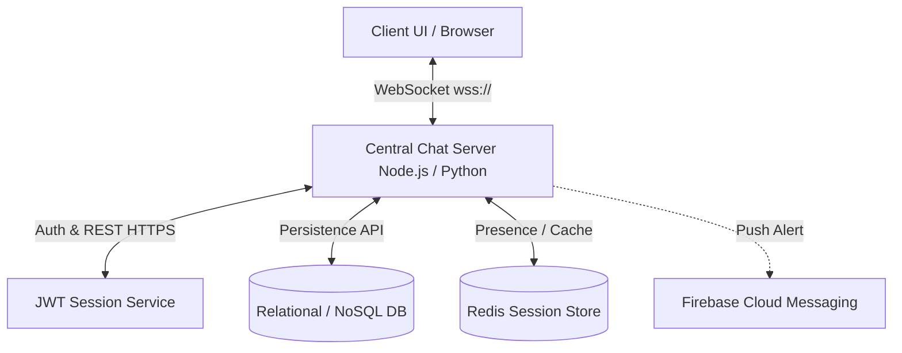
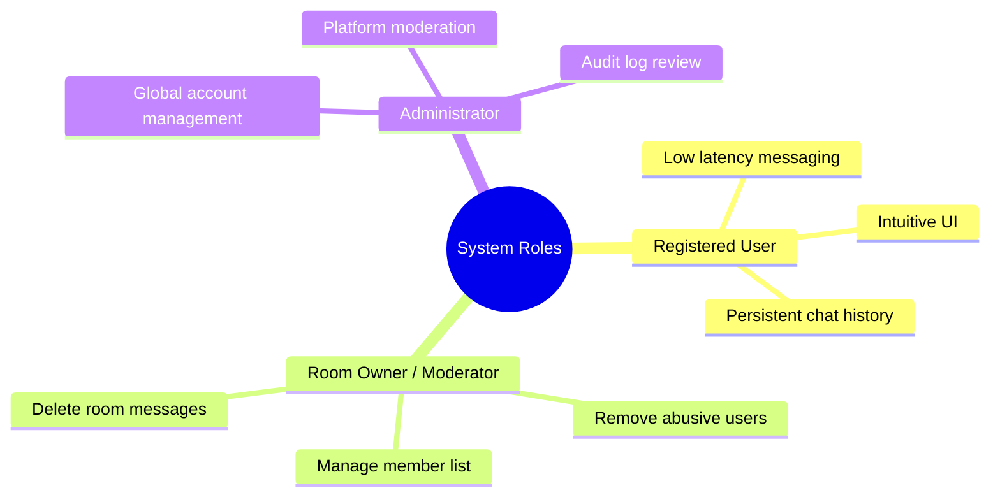
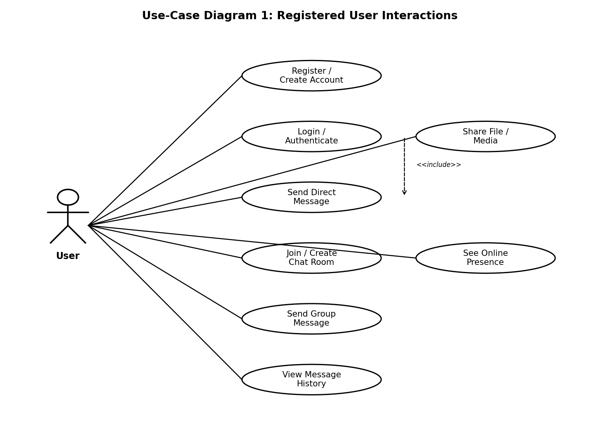
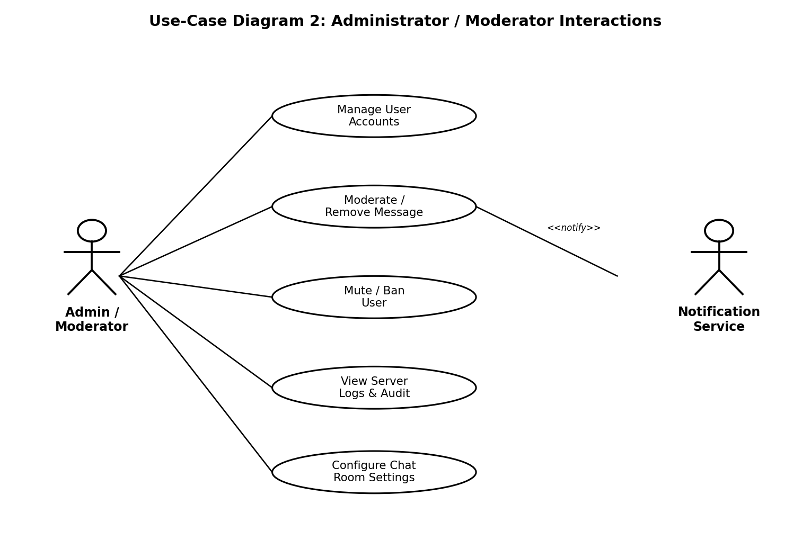

# 💬 Real-Time Chat Application — Software Requirements Specification (SRS)

> **Document Reference:** SRS-CHAT-2026-V1.0  
> **Project:** Chat Application (Socket Programming)  
> **Date:** September 3, 2026  

---

## 📌 Metadata & Team Contributions

### 👥 Team Members & Responsibilities

| Name | SRN | Contribution |
| :--- | :--- | :--- |
| **Pranay Shah** | `PES2UG24CS366` | Requirements gathering and stakeholder analysis; Sections 1–2 (Introduction, Overall Description); Section 6 (Quality Attributes & Acceptance Tests); overall document structuring, compilation, formatting, and final review. |
| **Nikhil Mahabala Shekar** | `PES2UG24CS318` | Section 4.1–4.3 functional requirements (Authentication, Direct Messaging, Group Chat/Rooms). |
| **Prarthana Herur** | `PES2UG24CS367` | Section 5 (NFRs & Security), Section 7 (UML Use-Case Diagrams) and Section 8 (RTM). |
| **Nikhil B Menon** | `PES2UG24CS317` | Section 3 (External Interfaces) and Section 4.4–4.7 functional requirements (Presence, History, File Sharing, Notifications). |

---

### 📜 Revision History

| Version | Date | Author(s) | Change Summary | Approval Status |
| :---: | :---: | :--- | :--- | :---: |
| **`1.0`** | 03-09-2026 | Pranay Shah, Nikhil Mahabala Shekar, Prarthana Herur, Nikhil B Menon | Initial SRS drafted for Chat Application project | `Pending` |

---

### ✍️ Approvals

| Role | Name | Signature / Email | Date |
| :--- | :--- | :---: | :---: |
| **Course Coordinator** | *TBD* | — | — |
| **Faculty Guide** | *TBD* | — | — |

---

## 📑 Table of Contents

- [1. Introduction](#1-introduction)
  - [1.1 Purpose](#11-purpose)
  - [1.2 Scope](#12-scope)
  - [1.3 Audience](#13-audience)
  - [1.4 Definitions, Acronyms and Abbreviations](#14-definitions-acronyms-and-abbreviations)
- [2. Overall Description](#2-overall-description)
  - [2.1 Product Perspective](#21-product-perspective)
  - [2.2 Major Product Functions](#22-major-product-functions)
  - [2.3 User Roles and Characteristics](#23-user-roles-and-characteristics)
  - [2.4 Operating Environment](#24-operating-environment)
  - [2.5 Constraints](#25-constraints)
- [3. External Interface Requirements](#3-external-interface-requirements)
  - [3.1 User Interfaces](#31-user-interfaces)
  - [3.2 Hardware Interfaces](#32-hardware-interfaces)
  - [3.3 Software Interfaces](#33-software-interfaces)
  - [3.4 Communications](#34-communications)
- [4. System Features (Detailed)](#4-system-features-detailed)
  - [4.1 User Registration & Authentication](#41-user-registration--authentication)
  - [4.2 Real-Time Direct Messaging](#42-real-time-direct-messaging)
  - [4.3 Group Chat / Chat Rooms](#43-group-chat--chat-rooms)
  - [4.4 Presence & Typing Indicators](#44-presence--typing-indicators)
  - [4.5 Message History & Persistence](#45-message-history--persistence)
  - [4.6 File & Media Sharing](#46-file--media-sharing)
  - [4.7 Notifications](#47-notifications)
- [5. Non-Functional Requirements (Detailed)](#5-non-functional-requirements-detailed)
  - [5.1 Performance, Scalability & Reliability](#51-performance-scalability--reliability)
  - [5.2 Security Requirements](#52-security-requirements)
- [6. Quality Attributes & Acceptance Tests](#6-quality-attributes--acceptance-tests)
- [7. System Models and Diagrams](#7-system-models-and-diagrams)
  - [7.1 Registered User Interactions](#71-registered-user-interactions)
  - [7.2 Administrator / Moderator Interactions](#72-administrator--moderator-interactions)
- [8. Requirements Traceability Matrix (RTM)](#8-requirements-traceability-matrix-rtm)
- [📄 Documents & Resources](#-documents--resources)

---

## 1. Introduction

### 1.1 Purpose
This document is a **Software Requirements Specification (SRS)** for a real-time **Chat Application** built using socket-based communication (**WebSockets**). It defines the functional and non-functional requirements, external interfaces, and verification criteria for the system. It serves as an authoritative reference for developers, QA engineers, system integrators, and project evaluators during design, implementation, and assessment phases.

### 1.2 Scope
The Chat Application enables registered users to exchange text and media messages in real time over persistent WebSocket connections, either **one-to-one (direct messaging)** or within **group chat rooms**.

* **Included Capabilities:** Client-side chat UI interactions, server-side application layer (Node.js with `ws`/`Socket.IO` or Python `Flask-SocketIO`), message routing and broadcast, presence tracking (online/offline/typing status), persistent message storage, and basic administrative moderation.
* **Out of Scope:** Voice/video calling, end-to-end WebRTC call signalling, and integration with third-party enterprise platforms (e.g., Slack, MS Teams).

### 1.3 Audience
- **Software Developers & Architects:** For implementation guidance and API design.
- **QA Engineers & Testers:** For test case generation and compliance verification.
- **System Integrators & DevOps:** For environment setup and deployment configurations.
- **Project Evaluators & Course Instructors:** For assessing project scope, architecture, and requirement coverage.

### 1.4 Definitions, Acronyms and Abbreviations

| Term / Abbreviation | Definition |
| :--- | :--- |
| **WS / WSS** | WebSocket / WebSocket Secure — a full-duplex communication protocol over a single TCP connection. |
| **API** | Application Programming Interface. |
| **UI** | User Interface. |
| **TLS** | Transport Layer Security (version 1.2 or higher). |
| **JWT** | JSON Web Token — standard for stateless, bearer session authentication. |
| **DB** | Database (Relational or NoSQL store). |
| **UUID** | Universally Unique Identifier. |
| **RTT** | Round-Trip Time (latency measurement). |
| **XSS** | Cross-Site Scripting attack vector. |
| **RTM** | Requirements Traceability Matrix. |

---

## 2. Overall Description

### 2.1 Product Perspective
The Chat Application is a standalone, self-contained client-server system. Clients (web browsers or lightweight desktop clients) establish a persistent WebSocket connection with a central chat server. The server manages connection lifecycles, routes direct messages, broadcasts room communications, tracks user presence state, and handles persistent database storage.

### 2.2 Major Product Functions
1. 🔐 **User Registration & Authentication:** Secure account creation, hashed password storage, JWT issuance, and login lockout.
2. 💬 **Real-Time Direct Messaging:** Low-latency 1-on-1 messaging over WebSocket connections.
3. 👥 **Group Chat Rooms:** Public/private room creation, invite-based joining, and broadcast messaging.
4. 🟢 **Presence & Typing Indicators:** Live online/offline status updates and real-time typing indicators.
5. 📜 **Message Persistence & History:** Database persistence of messages with paginated history scrolling.
6. 📁 **File & Media Sharing:** Controlled upload and delivery of images and document attachments.
7. 🔔 **Notifications:** Unread badge counters and push notifications for backgrounded/offline users.
8. 🛡️ **Administrative Moderation:** User mute/ban capabilities, message deletion, and audit logging.

### 2.3 User Roles and Characteristics

### 2.4 Operating Environment
* **Server Environment:** Node.js runtime (or Python 3.x with Flask-SocketIO) deployed on Linux-based VM/containers behind an Nginx reverse proxy terminating TLS.
* **Client Environment:** Modern web browsers supporting standard WebSockets (Chrome, Firefox, Edge, Safari) or cross-platform web containers.
* **Database & Cache:** PostgreSQL / MongoDB for message & user data; Redis for presence caching and pub/sub room management.

### 2.5 Constraints
* **Protocol:** Communication must operate over standard HTTP/HTTPS ports upgraded to WebSocket (`ws://` or `wss://`).
* **Concurrency Target:** Must sustain at least **500 concurrent WebSocket connections** per server instance.
* **Data Security:** Strict compliance with password hashing (bcrypt/argon2) and encrypted transport (TLS 1.2+).
* **Media File Limits:** Attachment uploads are restricted to standard document/image types within configurable size caps.

---

## 3. External Interface Requirements

### 3.1 User Interfaces
A responsive web interface featuring:
* Authentication screen (Login / Registration / Password Reset).
* Contact and Chat Room navigation sidebar.
* Active conversation window with message history stream and rich message composer.
* Real-time indicators (typing state, online/offline status, unread message badges).
* Accessible design (WCAG contrast compliant, keyboard navigation, screen-reader aria labels).

### 3.2 Hardware Interfaces
* **Client Hardware:** Standard PC/mobile hardware with network interface (Wi-Fi, Ethernet, Mobile Data) and input controls.
* **Server Hardware:** Cloud compute instance with sufficient CPU/RAM and high network I/O to maintain 500+ persistent TCP connections.

### 3.3 Software Interfaces
* **WebSocket Gateway API:** Bidirectional event-driven communication (Socket.IO events / raw WebSocket frames).
* **REST Authentication API:** JSON over HTTPS endpoints for login, registration, and token validation.
* **Persistence API:** Internal service layer interacting with SQL/NoSQL stores for records retrieval.
* **Notification Interface:** Firebase Cloud Messaging (FCM) or equivalent push service for offline alerts.

### 3.4 Communications
* Encrypted **TLS 1.2+ (`wss://`)** mandatory across all socket traffic and REST endpoints.
* Automatic reconnection with exponential backoff on client disconnections.
* Server-side ping/pong heartbeat frames to detect and prune dead connections.

---

## 4. System Features (Detailed)

> Requirements are uniquely tagged under format **`CHAT-F-###`** and paired with acceptance criteria and reference test cases.

### 4.1 User Registration & Authentication

| Req ID | Requirement | Type | Priority | Source | Acceptance Criteria / Test Ref | Dependencies |
| :---: | :--- | :---: | :---: | :---: | :--- | :--- |
| **`CHAT-F-001`** | The system shall allow a new user to register an account using a unique username/email and password. | Functional | `High` | End User | **AC-CHAT-F-001:** Valid unique registration creates account and returns success.  *Test:* `TC-Auth-01` | Password hashing required |
| **`CHAT-F-002`** | The system shall authenticate a returning user via credentials and issue a JWT session token. | Functional | `High` | End User | **AC-CHAT-F-002:** Correct credentials return valid JWT; invalid credentials are rejected.  *Test:* `TC-Auth-02` | `CHAT-F-001` |
| **`CHAT-F-003`** | The system shall reject invalid logins and lock the account for 5 minutes after 5 consecutive failed attempts. | Functional | `High` | Security | **AC-CHAT-F-003:** 6th consecutive failed attempt returns lockout message.  *Test:* `TC-Auth-03` | Audit logging required |

---

### 4.2 Real-Time Direct Messaging

| Req ID | Requirement | Type | Priority | Source | Acceptance Criteria / Test Ref | Dependencies |
| :---: | :--- | :---: | :---: | :---: | :--- | :--- |
| **`CHAT-F-010`** | The system shall establish a persistent WebSocket connection upon authenticated client login. | Functional | `High` | System | **AC-CHAT-F-010:** Connection upgrade succeeds; client receives ACK event.  *Test:* `TC-Msg-01` | `CHAT-F-002` |
| **`CHAT-F-011`** | The system shall deliver a 1-to-1 text message to an online recipient in real time ($< 1\text{s}$ target latency). | Functional | `High` | End User | **AC-CHAT-F-011:** Recipient receives message within target latency in test environment.  *Test:* `TC-Msg-02` | Open WS connection |
| **`CHAT-F-012`** | The system shall queue messages for offline recipients and deliver them upon next reconnect. | Functional | `High` | End User | **AC-CHAT-F-012:** Offline user receives queued messages in order upon reconnecting.  *Test:* `TC-Msg-03` | Message persistence |

---

### 4.3 Group Chat / Chat Rooms

| Req ID | Requirement | Type | Priority | Source | Acceptance Criteria / Test Ref | Dependencies |
| :---: | :--- | :---: | :---: | :---: | :--- | :--- |
| **`CHAT-F-020`** | The system shall allow a user to create a named group chat room and become its owner. | Functional | `High` | End User | **AC-CHAT-F-020:** Room created; creator assigned as owner.  *Test:* `TC-Room-01` | None |
| **`CHAT-F-021`** | The system shall allow a user to join an existing public room or private room via invite. | Functional | `High` | End User | **AC-CHAT-F-021:** User added to member list after join request.  *Test:* `TC-Room-02` | None |
| **`CHAT-F-022`** | The system shall broadcast room messages to all currently connected members of that room. | Functional | `High` | End User | **AC-CHAT-F-022:** All online room members receive broadcast message instantly.  *Test:* `TC-Room-03` | `CHAT-F-020`, `CHAT-F-021` |
| **`CHAT-F-023`** | The system shall allow a room owner to remove a member from the room. | Functional | `Medium` | Room Owner | **AC-CHAT-F-023:** Removed member loses access and receives notification.  *Test:* `TC-Room-04` | None |

---

### 4.4 Presence & Typing Indicators

| Req ID | Requirement | Type | Priority | Source | Acceptance Criteria / Test Ref | Dependencies |
| :---: | :--- | :---: | :---: | :---: | :--- | :--- |
| **`CHAT-F-030`** | The system shall display online/offline status of contacts and room members in real time. | Functional | `Medium` | End User | **AC-CHAT-F-030:** Status updates within 3 seconds of connection change.  *Test:* `TC-Pres-01` | None |
| **`CHAT-F-031`** | The system shall show a typing indicator to recipients while a message is being composed. | Functional | `Low` | End User | **AC-CHAT-F-031:** Indicator toggles based on active composition.  *Test:* `TC-Pres-02` | None |

---

### 4.5 Message History & Persistence

| Req ID | Requirement | Type | Priority | Source | Acceptance Criteria / Test Ref | Dependencies |
| :---: | :--- | :---: | :---: | :---: | :--- | :--- |
| **`CHAT-F-040`** | The system shall persist all direct and room messages (sender, timestamp, content) to database. | Functional | `High` | System | **AC-CHAT-F-040:** Every delivered message creates a database record.  *Test:* `TC-Hist-01` | Database layer |
| **`CHAT-F-041`** | The system shall support paginated retrieval and scrolling through historic conversation logs. | Functional | `Medium` | End User | **AC-CHAT-F-041:** Returns paginated messages in chronological order.  *Test:* `TC-Hist-02` | `CHAT-F-040` |

---

### 4.6 File & Media Sharing

| Req ID | Requirement | Type | Priority | Source | Acceptance Criteria / Test Ref | Dependencies |
| :---: | :--- | :---: | :---: | :---: | :--- | :--- |
| **`CHAT-F-050`** | The system shall allow uploading and sharing images/documents within size limits. | Functional | `Medium` | End User | **AC-CHAT-F-050:** File uploaded within limit is shared and downloadable.  *Test:* `TC-Media-01` | Storage Service |
| **`CHAT-F-051`** | The system shall reject file uploads exceeding max size limits or invalid file extensions. | Functional | `Medium` | Security | **AC-CHAT-F-051:** Oversized/invalid files rejected with clear error message.  *Test:* `TC-Media-02` | Validation engine |

---

### 4.7 Notifications

| Req ID | Requirement | Type | Priority | Source | Acceptance Criteria / Test Ref | Dependencies |
| :---: | :--- | :---: | :---: | :---: | :--- | :--- |
| **`CHAT-F-060`** | The system shall display unread-message badge counts for active chats with new messages. | Functional | `Medium` | End User | **AC-CHAT-F-060:** Badge increments on new message and clears when read.  *Test:* `TC-Notif-01` | UI state engine |
| **`CHAT-F-061`** | The system shall send push notifications to offline/backgrounded users on direct messages. | Functional | `Low` | End User | **AC-CHAT-F-061:** Push notification received on device within reasonable window.  *Test:* `TC-Notif-02` | Push Service |

---

## 5. Non-Functional Requirements (Detailed)

### 5.1 Performance, Scalability & Reliability

| Req ID | Requirement | Category | Priority | Acceptance / Measurement Criteria |
| :---: | :--- | :---: | :---: | :--- |
| **`CHAT-NF-001`** | End-to-end message latency shall be $\le 1\text{ second}$ for 95% of messages under normal operational load. | Performance | `High` | 95th percentile delivery latency $\le 1\text{s}$ under load testing.  *Test:* `TC-Perf-01` |
| **`CHAT-NF-002`** | Server shall sustain $\ge 500$ active concurrent WebSocket connections per instance without target latency degradation. | Scalability | `High` | Sustained 500 connections verified during load test.  *Test:* `TC-Perf-02` |
| **`CHAT-NF-003`** | System shall deliver 99.5% monthly availability excluding scheduled maintenance windows. | Reliability | `High` | Uptime monitoring logs confirm $\ge 99.5\%$ monthly operational state.  *Test:* `Ops Reports` |
| **`CHAT-NF-004`** | Chat UI shall be fully responsive across mobile and desktop viewport widths without functional loss. | Usability | `Medium` | UI test suite across 3+ screen viewport standard sizes passes.  *Test:* `TC-UX-01` |
| **`CHAT-NF-005`** | Errors and critical events shall be stored in a structured logging format for monitoring/alerting. | Maintainability | `Medium` | Log inspection verifies structured, timestamped JSON/syslog output.  *Test:* `TC-OPS-01` |

---

### 5.2 Security Requirements

#### 🔐 Security Objectives
1. Protect user credentials, passwords, and authorization tokens against exposure and interception.
2. Restrict operational capabilities so users can only view conversations, rooms, and functions they possess authorization for.
3. Prevent Cross-Site Scripting (XSS) and injection attacks via incoming message payload sanitization.

#### 🛡️ Detailed Security Requirements Matrix

| Req ID | Security Requirement | Type | Priority | Acceptance Criteria & Verification |
| :---: | :--- | :---: | :---: | :--- |
| **`CHAT-SR-001`** | TLS 1.2+ (`wss://` and `https://`) shall be strictly enforced; unencrypted HTTP/WS requests must be refused. | Security | `High` | **AC-CHAT-SR-001:** Plaintext connections are rejected at reverse proxy/server.  *Test:* `TC-Sec-01` |
| **`CHAT-SR-002`** | User passwords must be stored using salted, adaptive hashing (bcrypt or Argon2) and never plain text. | Security | `High` | **AC-CHAT-SR-002:** DB audit proves passwords stored exclusively as salted hashes.  *Test:* `TC-Sec-02` |
| **`CHAT-SR-003`** | Authentication tokens (JWT) must feature bounded expiration time and be validated on every request. | Security | `High` | **AC-CHAT-SR-003:** Tampered or expired JWT tokens return HTTP 401 / Unauthorized event.  *Test:* `TC-Sec-03` |
| **`CHAT-SR-004`** | All user-supplied message inputs must be sanitized/escaped prior to browser rendering to prevent XSS. | Security | `High` | **AC-CHAT-SR-004:** Message containing `<script>` tags renders safely as plain inert text.  *Test:* `TC-Sec-04` |
| **`CHAT-SR-005`** | Moderation and admin actions (ban/mute/delete) must be restricted by role and recorded in audit logs. | Security | `Medium` | **AC-CHAT-SR-005:** Non-admin requests fail authorization check; actions written to audit log.  *Test:* `TC-Sec-05` |

---

## 6. Quality Attributes & Acceptance Tests

### 🎯 Acceptance Exit Criteria
The platform release candidate qualifies for production deployment upon satisfying the following criteria:
- **100% Pass Rate** across all High-Priority functional requirements (`CHAT-F-001` through `CHAT-F-040`).
- Zero critical failures in security validation test cases (`TC-Sec-01` to `TC-Sec-05`).
- Successful execution of load tests matching performance targets ($\le 1\text{s}$ latency at 500 concurrent connections).
- 100% requirement coverage in the Requirements Traceability Matrix (RTM).

---

## 7. System Models and Diagrams

### 7.1 Registered User Interactions

The use case diagram below illustrates primary interactions for general registered users within the application:

*Figure 1: Registered User Use Case Diagram detailing Authentication, Direct Messaging, Room Management, Media Sharing, and History Retrieval.*

---

### 7.2 Administrator / Moderator Interactions

The use case diagram below details administrative and moderation capabilities over platform users and rooms:

*Figure 2: Administrator & Moderator Use Case Diagram detailing Account Management, Global/Room Moderation, Audit Logs, and Enforcement.*

---

## 8. Requirements Traceability Matrix (RTM)

The matrix below maps requirements to design specifications, system modules, test cases, and verification status.

| Req ID | Requirement Description | Design Spec Ref | Target Module | Associated Test Case(s) | Status | Comments |
| :---: | :--- | :---: | :---: | :---: | :---: | :--- |
| **`CHAT-F-002`** | Authenticate User via Credentials & JWT | `4.1 / DS-Auth-01` | `AuthModule` | `TC-Auth-02` | `Planned` | Core authentication flow |
| **`CHAT-F-011`** | Real-Time Direct Message Delivery | `4.2 / DS-Msg-01` | `MessagingModule` | `TC-Msg-02` | `Planned` | Sub-second latency target |
| **`CHAT-F-022`** | Broadcast Room Messaging | `4.3 / DS-Room-01` | `RoomModule` | `TC-Room-03` | `Planned` | WebSocket room pub/sub |
| **`CHAT-F-041`** | Paginated History Retrieval | `4.5 / DS-Hist-01` | `HistoryModule / DB` | `TC-Hist-02` | `Planned` | Indexed DB queries |
| **`CHAT-NF-001`** | Delivery Latency Target ($\le 1\text{s}$) | `5.0 / DS-Perf-01` | `MessagingModule` | `TC-Perf-01` | `Planned` | Verified under load test |
| **`CHAT-SR-004`** | XSS Message Sanitization | `5.1.2 / DS-Sec-01` | `MessagingModule / UI` | `TC-Sec-04` | `Planned` | Frontend rendering escape |

*Status Key: `Planned` (N) | `In Progress` (P) | `Approved` (A)*

---

## 📄 Documents & Resources

* 📕 **Official SRS Document (PDF):** [`Chat_Application_SRS.pdf`](./Chat_Application_SRS.pdf)
* 📘 **Editable Document Source (DOCX):** [`Chat_Application_SRS.docx`](./Chat_Application_SRS.docx)
* 🖼️ **Diagram Assets:** [`assets/usecase_user_interactions.png`](./assets/usecase_user_interactions.png) & [`assets/usecase_admin_interactions.png`](./assets/usecase_admin_interactions.png)

---

  <b>Chat Application SRS — Software Engineering Project</b> 
  PES University • Department of Computer Science & Engineering

